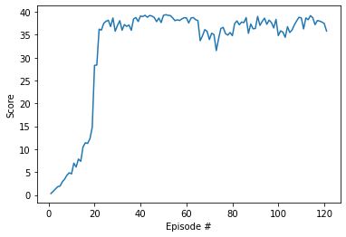

# Learning Algorithm

## Deep Deterministic Policy Gradient (DDPG)
I chose the DDPG algorithm and adapeted the version that solved the ddpg-pendulum environment successfully. 
The introduction of batch-normalization for the first layer of the actor as well as the critic network lead to a more steady training without increasing the training time to much. 
In my opinion the task should not be that complex for the ddn model, so I chose smaller sized networks with 256 hidden units in the first layer and 128 in the second. This was successful, but did not result in faster training time to the extent I had expected. Trying to make the Critic network smaller than the actor once lead to a worse performance, but with another setup seemed not to have to much of an impact. 

## Parameters
BUFFER_SIZE = int(1e6)  # replay buffer size  
BATCH_SIZE = 256        # minibatch size  
GAMMA = 0.99            # discount factor  
TAU = 1e-3              # for soft update of target parameters  
LR_ACTOR = 1e-3         # learning rate of the actor   
LR_CRITIC = 2e-3        # learning rate of the critic  
WEIGHT_DECAY = 0.00001   # L2 weight decay  
UPDATE_INTERVAL = 20  
LEARN_PASSES=10  
EPSILON=1  
EPSILON_DECAY=1e-6   

The higher learning rate for the actor and the ciritic seemed not to affect the results much. Whereas a WEIGHT_DECAY higher than 0.00001 hat a verry negative effect on the training process.  
The implementation of Epsilon decay to reduce the noise and therefor the probability that a random action is taken later in the training process seemd to be beneficial. 
A Buffer Size of 10e5 was much to small, whereas choosing the Buffer Size of 10e6 lead to good results, in synergy with the chosen epsilon decay rate.  
Particularly important and with serious implications was the selected seed parameter. Here in my case `seed = 3` lead to good training results, whereas values like e.g. 1, 2 or 541 ... did not. 

## Plot of Rewards:
The Plot showing an average reward over 30 can be found in Continuous_Control.ipynb and here: .  
With Episode 21 the reward was the first time bigger than 30. The following consecutive 100 episodes were also each with rewards >=30. So the training was successfully stopped after episode 121.

# Ideas for Future Work:
Tuning the DDPG algorithm required a lot of trial and error. Especialy the dependency on the random seed was a downside in my opinion. So more research should be done on how this dependency on a randomnes at the initialization can be reduces. Probably for this task/application other reinforcement learning algorithms are more beneficial. 
Perhaps another algorithms like [Proximal Policy Optimization (PPO)](Proximal Policy Optimization Algorithms), or Distributed Distributional Deterministic Policy Gradients (D4PG) would be more robust.

Maybe in the learning step, when the buffer is filled to a certain amount (for example 1/4 or 1/3) not just randomly select episodes from the replay buffer, but instead search for episodes that had a reward > a certain reference value. I think this is called prioritized experience replay.

